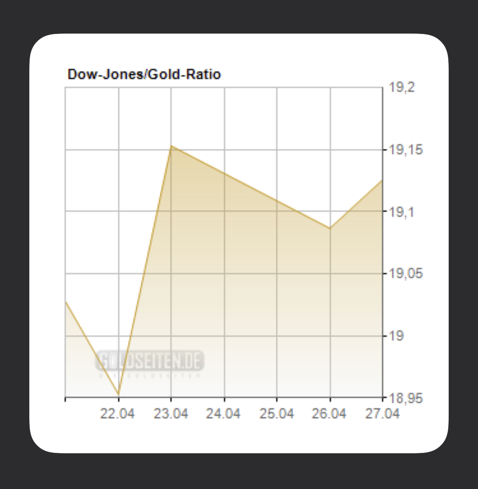

# Dow Jones to Gold Ratio Widget
A widget for the iOS app 'Scriptable' that shows the Dow Jones to Gold ratio of the last 5 days

# Setup
- just copy the whole code of the file dowJonesGoldRatioWidget.js into a new script in your Scriptable app
- alternatively you can use the following link: https://scriptdu.de/?name=dowJonesGoldRatioWidget&source=https%3A%2F%2Fraw.githubusercontent.com%2Flwitzani%2FdowJonesGoldRatioWidget%2Fmain%2FdowJonesGoldRatioWidget.js%3Ftoken%3DAGKXXFWL36PZT4K3Y3YORNDARGXSQ&docs=https%3A%2F%2Fgithub.com%2Flwitzani%2FdowJonesGoldRatioWidget
- there is only one variable at the top of the script that matters: FILE_MANAGER_MODE
    - use FILE_MANAGER_MODE = 'LOCAL' if you do not use icloud
    - use FILE_MANAGER_MODE = 'ICLOUD' (or anything else) if you use icloud
    
- default is FILE_MANAGER_MODE = 'ICLOUD'

# Technical Background
- the graph shown is a finished image that is just loaded from the web
- the image is not loaded every time the script runs but only once a day
- the script saves the image and a json file to the phone or to iCloud
- the json file contains the last date the image was updated (to know when to update again)